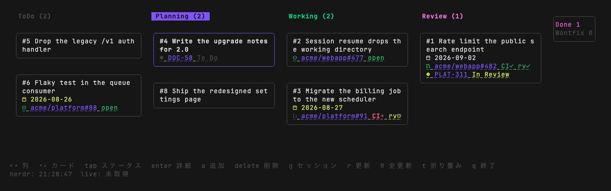
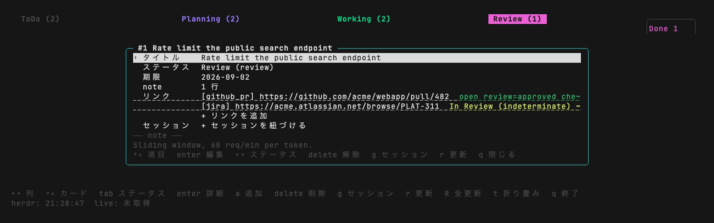

# taskherd

コーディングエージェントの作業を並べて見る kanban ボード。

タスクはローカルの JSON ファイル 1 枚に置かれます。1 つのタスクにエージェントセッション・GitHub
の PR や Issue・Jira チケットを紐づけられ、ボードはそれらが今どうなっているかをまとめて表示します。

[English README](README.md)



## できること

- **並走するエージェントを 1 枚で把握する。** 複数のセッションが同時に動くと、どれが何をしている
  のかが分からなくなります。タスクがセッションを持つので、ボードを見れば分かります。`g` でその
  セッションへ移動でき、まだ無ければその場で起こせます。
- **リンクではなく状態を見る。** PR の CI・レビュー結果・Jira のステータスを取得してキャッシュ
  するので、カードには URL ではなく `CI✓ rv✓` が出ます。
- **どれが無くても動く。** herdr も `gh` もネットワークも要りません。add / list / move / note /
  link は全部そのまま使えます。連携は加算であって前提ではありません。
- **スクリプトから叩ける CLI。** 全コマンドが `--json` を受け、その下では一切対話しません。
- **日本語と英語。** `language = "ja"` / `"en"`、その場限りなら `TASKHERD_LANG`。

## インストール

```sh
curl -fsSL https://raw.githubusercontent.com/ukwhatn/taskherd/main/install.sh | sh
```

`~/.local/bin` に入るので、後から `taskherd update` が sudo なしで置き換えられます。他の方法として
[releases](https://github.com/ukwhatn/taskherd/releases) からのアーカイブ取得、
`go install github.com/ukwhatn/taskherd/cmd/taskherd@latest` があります。

[herdr](https://herdr.dev) プラグインとして入れる場合:

```sh
herdr plugin install ukwhatn/taskherd
```

対応は macOS と Linux。既定のアイコンには Nerd Font が必要です（不要にするなら
`board.icons = "ascii"`）。

## 使いはじめ

```sh
taskherd config init                                   # コメント付きの config.toml を生成する
taskherd add "検索エンドポイントにレート制限を入れる" --due 2026-09-02
taskherd link 1 https://github.com/acme/webapp/pull/482
taskherd start 1 --cwd ~/src/webapp                    # このタスクでセッションを起こす
taskherd board                                         # ボードを開く
```

ボードの操作は、矢印で移動、`Enter` で詳細、`Tab` で列の変更、`a` で追加、`g` でセッションへ移動、
`q` で終了。



## ドキュメント

ドキュメント本体は英語です。

| | |
|---|---|
| [Commands](docs/commands.md) | 全コマンドとフラグ |
| [Configuration](docs/configuration.md) | `config.toml` の全設定と、読む環境変数 |
| [Keybindings](docs/keybindings.md) | ボードのキー・マウス操作と、カードの読み方 |
| [herdr integration](docs/herdr-integration.md) | プラグインの導入・キー割り当て・セッション起動 |
| [Development](docs/development.md) | ビルド・テストとパッケージ構成 |

## ライセンス

MIT（[LICENSE](LICENSE)）
