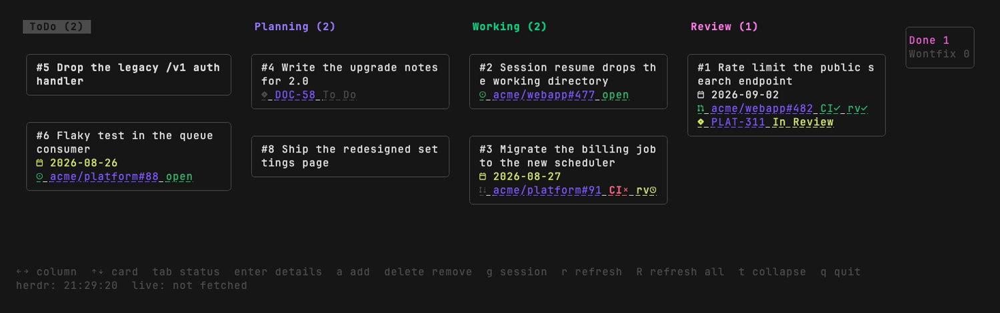
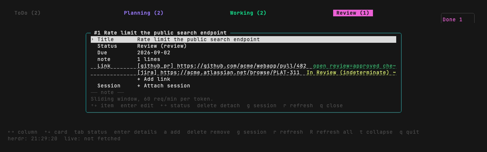

# The board

`taskherd board` opens it. The grammar is the one a GUI uses: **arrows move, Enter confirms, Tab
switches, Delete removes.**

Closing splits in two. **A screen with no text field closes with `q`; `Esc` is for leaving a field
or an edit.** Only the screens where `q` would be typed as a character — the add modal, the start
modal, an edit inside the detail modal, the picker — close with `Esc`.

## Keys

| Key | |
|---|---|
| `←` `→` | Move between columns |
| `↑` `↓` | Move between cards |
| `Tab` | Open the status selector (the next column is preselected; `←→` to choose, `Enter` to confirm, `q` to close) |
| `Enter` | Open the task |
| `Delete` / `Backspace` | Delete the task (`y`/`n` first) |
| `a` | Add a task |
| `g` | Go to the task's session — `↑↓` to choose if there are several. With none attached, open the start modal. Either way the board closes |
| `r` / `R` | Refetch the focused card / everything |
| `t` | Fold or unfold the terminal columns |
| `q` / `Ctrl+C` | Quit (an open modal closes first) |

## Mouse

The board takes mouse input, assuming herdr forwards it into the pane.

| | |
|---|---|
| Left click on a card | Select it and open it (same as `Enter`) |
| Wheel up/down | Move between cards in the focused column |
| Wheel left/right | Move between columns |

Clicks and wheel events outside the board are ignored, and while any modal or dialog is open the
mouse is ignored entirely — nothing behind it is clickable.

## Reading a card

- Cards are rounded boxes; the selected one takes its column's color on the border. A column header
  shows its label and count, and the focused column is inverted.
- **One link is one row**, drawn as `<icon> <repo>#<number> <state>` — for example
  `<pr> acme/webapp#482 CI✓ rv✓`. As the column narrows the row drops to `webapp#482` and then
  `#482`: the number survives to the end. A card with many links draws three rows and folds the
  rest into `and N more`.
- The repo name and number come from the URL, so a card says what it links to before anything has
  been fetched, and offline. Only the state at the end of the row comes from the cache; an unfetched
  link reads `not fetched` in grey.
- **State is carried by color** (below). Past the TTL, only the *age* is dimmed — the state keeps
  its color. While a fetch keeps failing, the last successful value stays put and a warning icon
  plus the elapsed time is added in red, so "showing a value but not updating" is distinguishable.
- A title wraps to **two lines** at most; what does not fit is cut with `~`.
- Cards that do not fit are counted by overflow indicators (`<up> N` / `<down> N`) and scroll with
  the cursor. Nothing is silently dropped.
- Folded terminal columns collect at the **right edge** as a vertical stack of labels and counts.
  While folded they are skipped by `←→`; `t` brings them back.
- **Column width is set by what a card needs to be readable** (24 cells of content), and the number
  of columns follows the terminal. Columns that do not fit are reached by scrolling
  (`~ columns 3-5 / 6` says where you are). Gaps and borders are dropped first if that buys one more
  column. In a width where not even one fits, the board says so instead of drawing.

| | Color |
|---|---|
| PR state | open=green / draft=grey / merged=purple / closed=red |
| CI (checks) | pass=green / fail=red / pending=yellow / unset=not shown |
| Review decision | approved=green / changes requested=red / review required=yellow |
| Issue state | open=green / closed=purple |
| Jira status category | new=grey / indeterminate=yellow / done=green |
| Session state | blocked=red / working=green / done=yellow / idle=grey / offline=dim grey |
| Due date | overdue=red / today or tomorrow=yellow / later=default |
| A fetch that keeps failing | red (warning icon plus how long it has been failing) |
| Age past the TTL | dim grey (the state keeps its own color) |
| Column header, selected border | the column's `color` |

Colors are ANSI 16 only, so the board follows your terminal's theme.

## The detail modal (`Enter`)

One grammar throughout: `↑↓` to pick an item, `Enter` to edit it. The items are title, status, due
date, note, each link, add link, each session, attach session.

- **Status**: `←→` changes it in place; `Enter` opens the selector.
- **note**: `Enter` opens your editor (`editor` / `$VISUAL` / `$EDITOR`). The board steps aside
  while it runs.
- **A link row**: `Enter` edits its note, `Delete` detaches it after a confirmation.
- **Add link**: several URLs at once, separated by whitespace or newlines. One bad URL cancels the
  whole thing.
- **A session row**: `Enter` jumps to it, `Delete` detaches it after a confirmation.
- **Attach session**: pick from the agents herdr can see, with `↑↓`. Shown as unavailable when herdr
  is not reachable.
- `q` returns to the board. The exception is a detail opened directly by `link-pane` on an
  already-attached task, where `q` closes the popup outright — there is no board behind it.
- While editing an item, `Esc` cancels the edit (`q` is a character there).

## The add modal (`a`)

The same item list as the detail modal — title, status, due date, note, links — except that
**whatever item is focused is already editable**; there is no `Enter` to open it.

- `↑↓` moves between items and keeps what you have typed.
- Status starts on the focused column; `←→` changes it.
- **`Enter` creates and closes, from any item** (an empty title is an error and does not close).
  `Esc` cancels.
- Pasting several lines into the title creates **one task per line**, with the other items applied
  to all of them.
- Since `Enter` creates, a newline is **`Shift+Enter` / `Alt+Enter` / `Ctrl+J`**. `Shift+Enter` is
  only distinguishable on terminals that answer the keyboard-enhancement query; a terminal
  configured to send ESC+CR for it (ghostty and others) arrives as `Alt+Enter`, which is accepted
  too. A newline in the title splits tasks; a newline in the note is just a newline. The footer says
  which key is live.

## The start modal (`g` on a task with no session)

Holds a list of candidate working directories — the cwds of existing sessions, by frequency, then
by how recently they were linked, then alphabetically — and an editable initial prompt.

- `Tab` switches between the directory and the prompt.
- `↑↓` picks a directory. The last row (*type one*) turns it into free text.
- The prompt is multi-line. **`Enter` launches from anywhere in it**, so newlines use the same keys
  as the add modal.
- `Ctrl+Y` copies the prompt to the clipboard (OSC 52; it lands only on terminals that support it,
  and there is no way to confirm that it did).
- `Enter` launches. **The launch itself runs outside the board** — see
  [herdr integration](herdr-integration.md#a-launch-from-the-board-runs-outside-it). The board
  closes, so you land on the new tab.
- `Esc` closes the modal.

## Text fields

- **Paste**: bracketed paste is supported, so URLs and task lists go straight in from the terminal.
- **Input methods**: a committed IME string is always text, never a command key. Even on screens
  with no text field (confirmations, selectors) an event carrying several characters at once is not
  read as a key name.
